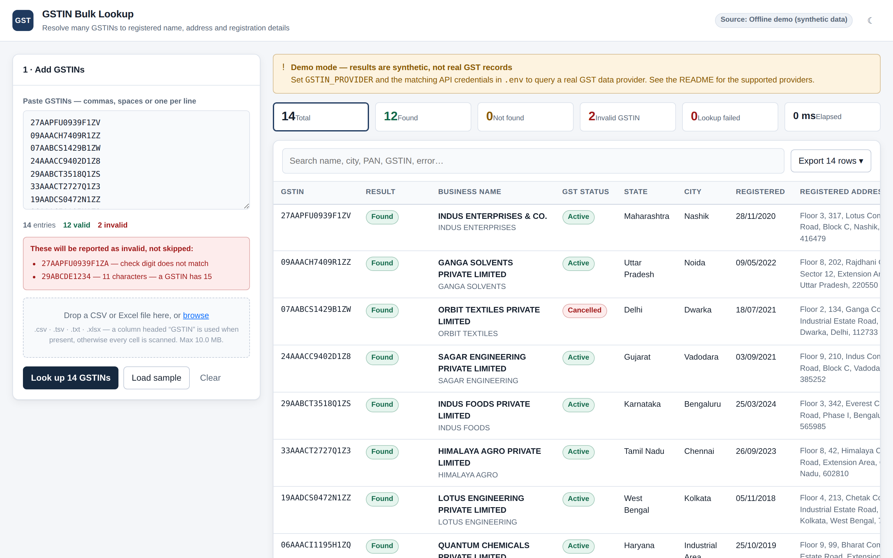

# GSTIN Bulk Lookup

Paste, drop or upload a list of Indian **GSTINs** and get the registered business
name, full address, taxpayer type, registration dates and jurisdiction for each
one — then export the lot as Excel, CSV, PDF or JSON.

Built for the mundane reality of vendor onboarding and AP reconciliation: you
have a spreadsheet with 300 GSTINs, some of them typos, and you need to know
which are real, which are cancelled, and where each business is registered.



---

## What it does

- **Bulk input, any shape** — paste comma-separated, space-separated or one per
  line; or upload `.csv` / `.tsv` / `.txt` / `.xlsx`. A column headed *GSTIN* is
  used when present; otherwise every cell is scanned for GSTIN-shaped values.
- **Offline validation first** — layout, GST state code, embedded PAN and the
  mod-36 check digit are verified locally, so a mistyped GSTIN is rejected
  instantly instead of burning an API call.
- **Nothing is silently skipped** — every input produces exactly one row, tagged
  `Found`, `Not found`, `Invalid GSTIN` or `Lookup failed`, each failure carrying
  a plain-English reason and a machine-readable code.
- **Streaming results** — rows appear in the table as they resolve, with a live
  progress bar and a Stop button, rather than a spinner until the slowest one.
- **Full detail per GSTIN** — click any row for legal and trade name, principal
  and additional places of business, nature of business, both jurisdictions,
  e-invoice status, the facts derived from the GSTIN itself, and the raw
  provider payload.
- **Exports that match what you see** — filter and search first; the export
  contains exactly the visible rows, failures included.
- **Pluggable data source** — ships with four real provider adapters and a
  generic one, plus an offline demo mode so the app runs with zero credentials.

---

## Quick start

```bash
cd gstin-bulk-lookup
npm install
cp .env.example .env      # optional — the defaults work as-is
npm run dev
```

Open **http://localhost:5173**. The API runs on **http://localhost:4000** and the
Vite dev server proxies `/api` to it.

Click **Load sample** then **Look up** to see the whole flow, or drop
[`samples/vendors.csv`](samples/vendors.csv) onto the upload zone — it contains
12 valid GSTINs plus a typo, a truncated entry and an `N/A`, so you can see how
each failure is reported.

> Out of the box the app runs in **demo mode**: results are synthetic data
> generated locally, clearly labelled in the UI. Configure a real provider below
> before relying on anything.

### Production build

```bash
npm run build      # compiles the API and bundles the SPA
npm start          # single process on http://localhost:4000, serving both
```

`npm start` serves the built front end from the same origin as the API, so no
CORS configuration or second process is needed.

Requires **Node.js 18.17+** (Node 20 or 22 recommended).

---

## Choosing a data source

GSTIN details come from the GST Network. GSTN does not expose an unauthenticated
public API — the official *Search Taxpayer* page is captcha-gated and its terms
do not permit scraping — so production use goes through a **GST Suvidha Provider
(GSP)** or a licensed aggregator, with your own API key.

Set `GSTIN_PROVIDER` in `.env` to one of:

| `GSTIN_PROVIDER` | Service | Required environment variables |
|---|---|---|
| `mock` *(default)* | Offline demo — **synthetic data** | none |
| `gstincheck` | [GST India API](https://gstincheck.co.in) | `GSTINCHECK_API_KEY` |
| `appyflow` | [Appyflow GST API](https://appyflow.in/gst-api) | `APPYFLOW_API_KEY` |
| `mastersindia` | [Masters India](https://mastersindia.co) (GSTN-authorised GSP) | `MASTERSINDIA_CLIENT_ID`, `MASTERSINDIA_CLIENT_SECRET`, `MASTERSINDIA_USERNAME`, `MASTERSINDIA_PASSWORD` |
| `custom` | Any endpoint returning the standard GSTN payload | `CUSTOM_PROVIDER_URL` |

The server refuses to start if the selected provider is missing credentials, and
tells you which variable is absent.

All of these relay the same GSTN *search taxpayer* structure, so one normaliser
(`server/src/lib/gstnMapper.ts`) covers them and the rest of the application is
provider-agnostic. Adding another provider means writing one class that
implements `GstinProvider` and registering it in `server/src/providers/index.ts`.

### Pointing at your own endpoint

```bash
GSTIN_PROVIDER=custom
CUSTOM_PROVIDER_URL=https://gst-proxy.internal/v1/taxpayer/{gstin}
CUSTOM_PROVIDER_HEADERS={"Authorization":"Bearer ..."}
CUSTOM_PROVIDER_DATA_PATH=data
```

`{gstin}` is substituted into the URL; `CUSTOM_PROVIDER_DATA_PATH` is the dotted
path to the GSTN payload inside the response (blank means the response root).

---

## Legal and compliance notes

- A GSTIN's registered name, address and status are **public information** that
  GSTN itself publishes through its *Search Taxpayer* service; looking them up is
  routine due diligence. That does not make every route to the data acceptable.
- **Use a licensed provider.** The adapters above all call services that are
  authorised to redistribute GSTN data. Do not point this app at the GST portal's
  internal endpoints or at a captcha-bypassing scraper.
- **Respect your plan's rate limits.** `LOOKUP_CONCURRENCY` defaults to a
  conservative 5 parallel calls; raise it only as far as your contract allows.
- **Cache honestly.** Results are cached in memory for `CACHE_TTL_MINUTES`
  (default 12 hours) to avoid re-billing the same lookup. Check that your
  provider's terms permit caching for the retention you configure.
- **Verify before you act.** Registration status changes. For anything with legal
  or financial consequence, confirm against the official portal at
  <https://services.gst.gov.in/services/searchtp>.
- The app stores no lookup history on disk and holds no database; results live in
  the browser tab and in the in-memory cache until the process restarts.

---

## How a lookup is resolved

```
input  →  normalise (strip spaces/dashes, upper-case)
       →  validate offline   ─ fail ⇒ status "invalid", no API call
       →  in-memory cache    ─ hit  ⇒ status from cache, no API call
       →  provider           ─ bounded concurrency, retry on 429/5xx/timeout
       →  normalise payload  ─ canonical GstinRecord
```

Duplicate GSTINs in one batch are looked up **once**; the answer is copied to
every occurrence and marked `cached`, so a 500-row sheet with 40 unique vendors
costs 40 API calls but still returns 500 rows.

### What offline validation catches

A GSTIN is 15 characters: a 2-digit state code, the holder's 10-character PAN, a
registration serial, a registration-class character (`Z` for ordinary
registrations, `D`/`C`/`U` for TDS/TCS/UIN), and a mod-36 check digit. The
validator checks all five, so typos, transpositions and truncated entries are
caught before any credit is spent.

---

## API

All endpoints are under `/api` and rate-limited per client IP.

| Method | Path | Purpose |
|---|---|---|
| `GET` | `/health` | Liveness plus whether the provider is configured |
| `GET` | `/config` | Provider info, batch limits, GST state-code table |
| `POST` | `/validate` | Offline validation only — no upstream calls |
| `POST` | `/lookup` | Resolve a batch, respond when all rows have settled |
| `POST` | `/lookup/stream` | Same, streamed as newline-delimited JSON |
| `POST` | `/upload` | Parse a CSV/TSV/TXT/XLSX file into GSTIN candidates |
| `POST` | `/export/:format` | Render rows as `csv`, `xlsx`, `pdf` or `json` |
| `GET` `DELETE` | `/cache` | Inspect or clear the lookup cache |

```bash
curl -X POST http://localhost:4000/api/lookup \
  -H 'content-type: application/json' \
  -d '{"gstins":["27AAPFU0939F1ZV","09AAACH7409R1ZZ","27AAPFU0939F1ZA"]}'
```

```jsonc
{
  "results": [
    {
      "input": "27AAPFU0939F1ZV",
      "gstin": "27AAPFU0939F1ZV",
      "status": "success",
      "record": {
        "legalName": "…", "tradeName": "…", "status": "Active",
        "taxpayerType": "Regular", "constitutionOfBusiness": "Partnership",
        "registrationDate": "28/11/2020",
        "principalAddress": { "city": "…", "state": "…", "pincode": "…", "formatted": "…" },
        "additionalAddresses": [],
        "derived": { "pan": "AAPFU0939F", "stateName": "Maharashtra", "entityType": "Firm / Partnership" }
      },
      "message": null, "code": null, "source": "mock", "cached": false, "durationMs": 118
    },
    {
      "input": "27AAPFU0939F1ZA",
      "status": "invalid",
      "record": null,
      "code": "INVALID_CHECKSUM",
      "message": "check digit (15th character) does not match the rest of the GSTIN"
    }
  ],
  "summary": { "total": 3, "success": 2, "invalid": 1, "notFound": 0, "errors": 0, "cached": 0, "durationMs": 133, "provider": "mock" }
}
```

`/lookup/stream` emits one JSON object per line: a `start` frame, one `result`
frame per row as it settles, then a `summary` frame.

Exports are stateless — the client posts back the rows it is displaying, so the
file always matches the filtered view without a second lookup.

---

## Configuration reference

Every variable, with its default, is documented in
[`.env.example`](.env.example). The ones worth knowing:

| Variable | Default | Notes |
|---|---|---|
| `GSTIN_PROVIDER` | `mock` | Data source; see the table above |
| `MAX_BATCH_SIZE` | `500` | Largest batch accepted in one request |
| `LOOKUP_CONCURRENCY` | `5` | Parallel upstream calls |
| `REQUEST_TIMEOUT_MS` | `15000` | Per-GSTIN upstream timeout |
| `MAX_RETRIES` | `2` | Retries on timeout / 429 / 5xx |
| `CACHE_TTL_MINUTES` | `720` | In-memory cache lifetime |
| `MAX_UPLOAD_MB` | `10` | Upload size limit |
| `RATE_LIMIT_MAX_REQUESTS` | `300` | Per IP, per `RATE_LIMIT_WINDOW_MINUTES` |
| `PORT` | `4000` | API port |

---

## Project layout

```
gstin-bulk-lookup/
├── server/                    Node.js + Express + TypeScript API
│   └── src/
│       ├── lib/               GSTIN validation, GSTN normaliser, cache, HTTP, pool
│       ├── providers/         mock · gstincheck · appyflow · mastersindia · custom
│       ├── services/          batch orchestration, file parsing, exporters
│       ├── routes/            lookup · upload · export
│       └── __tests__/         57 tests
├── web/                       React 18 + TypeScript + Vite SPA
│   └── src/
│       ├── components/        InputPanel · SummaryBar · ResultsTable · DetailDrawer · ExportMenu
│       ├── lib/               client-side validation mirror, formatters
│       └── styles/            design tokens, light + dark themes
└── samples/vendors.csv        Example upload
```

## Tech stack

**Backend** — Node.js 18+, Express 4, TypeScript (strict), Zod for request
validation, ExcelJS and PDFKit for exports, Multer for uploads, express-rate-limit.

**Frontend** — React 18, TypeScript (strict), Vite 6, hand-rolled CSS with design
tokens and a light/dark theme. No UI framework and no runtime dependencies beyond
React, so the production bundle is ~55 kB gzipped.

## Tests

```bash
npm test                       # 57 tests
npm run typecheck              # strict TypeScript across both workspaces
```

Coverage includes the check-digit algorithm (verified against GSTINs published in
GST documentation), the structural validator, the GSTN payload normaliser, CSV
and XLSX parsing, the full HTTP surface (lookup, streaming, upload and all four
export formats), and the provider transport path — retry on 5xx, timeout, and
the mapping of 401/429 to messages that name the fix — driven against a local
stub that speaks the GSTN response shape.

## Licence

MIT.
